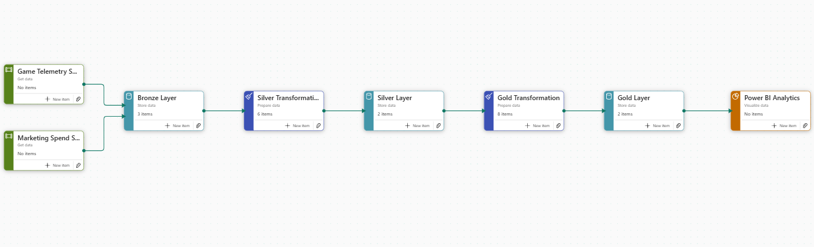
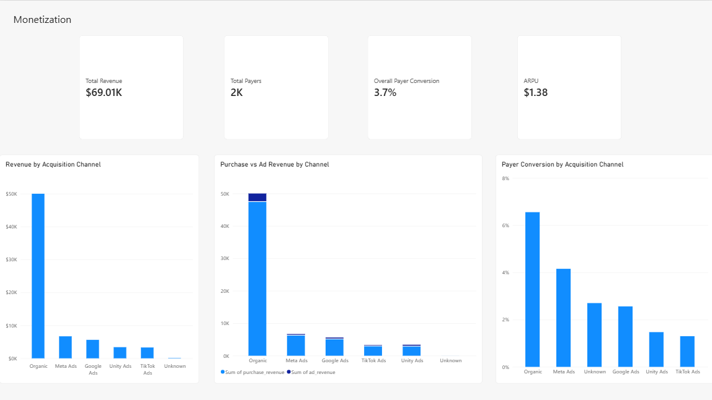

# Mobile Game Analytics Platform on Microsoft Fabric

An end-to-end analytics project for a synthetic free-to-play puzzle game, built to analyze player retention, monetization, level difficulty, marketing efficiency, and A/B experiments.

The project processes high-volume gameplay and marketing data in Microsoft Fabric and turns it into business-ready datasets and Power BI dashboards.

## What I Built

I designed the project around a Bronze–Silver–Gold architecture in Microsoft Fabric.

The source data includes player profiles, sessions, level events, purchases, ad revenue, and marketing spend.

The workflow covers:

- raw data ingestion into Fabric Lakehouse
- PySpark-based cleaning and transformation
- data quality handling
- analytical Gold tables
- SQL analysis
- Direct Lake semantic modeling
- Power BI reporting
- product and creative experiment analysis

## Architecture



The main analytical flow is:

Game Telemetry + Marketing Data  
→ Bronze  
→ Silver  
→ Gold  
→ Semantic Model  
→ Power BI

Rather than querying raw event data directly from reports, I created dedicated Gold tables for specific analytical use cases such as retention, monetization, marketing, and level performance.

## Dataset

The dataset simulates approximately 50,000 players over a 90-day period.

It contains:

- ~403K sessions
- ~3.7M level events
- purchase transactions
- ad monetization events
- paid acquisition campaign data

The full raw dataset is not included in the repository because of its size.

See [Data Dictionary](05_docs/data_dictionary.md).

## Data Engineering Decisions

The source data intentionally contains realistic data quality issues.

During the Silver transformation layer, I handled cases such as:

- duplicate events
- missing session identifiers
- invalid timestamps
- orphan session references
- missing paid acquisition attributes
- inconsistent event structures
- incomplete gameplay telemetry

I kept the Bronze layer unchanged and applied cleaning rules only in Silver so that the raw source remained traceable.

Invalid or missing session references were handled without breaking downstream aggregations, while unknown states were preserved explicitly where appropriate.

## Analytics Layer

I created eight main Gold datasets.

| Table | Main Use |
|---|---|
| `player_metrics` | Player-level engagement, progression and revenue |
| `daily_kpis` | DAU, sessions and daily revenue |
| `retention_cohorts` | D1, D7 and D30 cohort retention |
| `level_performance` | Level difficulty, attempts and booster usage |
| `monetization_metrics` | ARPU, ARPPU and payer conversion |
| `marketing_performance` | CPI, CAC, CTR, CVR and ROAS |
| `creative_performance` | Creative efficiency and downstream player quality |
| `experiment_metrics` | Product and creative A/B test results |

One important analytical decision was calculating channel retention using cohort-size weighted averages rather than averaging cohort percentages directly.

## Dashboard

The Power BI report contains six analytical views.

### Executive Overview


The overview combines game health, retention, monetization, and acquisition metrics.

Key results:

- 50K players
- approximately $69K total revenue
- 3.7% payer conversion
- $1.38 ARPU
- D1 retention: 43.2%
- D7 retention: 22.3%
- D30 retention: 4.5%

### Retention & Engagement


Organic users showed the strongest retention performance.

For cohort trend analysis, I excluded cohorts that had not yet reached the required retention window to avoid right-censoring recent installs.

This was especially important when evaluating D7 retention.

### Level Performance


Across 459 observed levels:

- average fail rate was 33.2%
- average attempts were 1.49
- booster usage rate was 36.3%

Later levels generally became more difficult.

Levels with higher failure rates also tended to show higher booster usage, suggesting a relationship between difficulty and booster demand.

### Monetization



Approximately 3.7% of players became payers.

Organic users generated strong monetization performance despite having no paid acquisition cost.

Revenue was also evaluated separately for purchase and advertising monetization.

### Marketing & Creative


Paid acquisition results showed that CPI alone was not enough to judge channel performance.

Meta had a relatively high CPI but also the strongest ROAS among paid acquisition channels.

This reinforced the need to evaluate acquisition sources using downstream player value rather than installation cost alone.

## Product Experiment

### Daily Reward Redesign

The primary metric was D7 retention.

| Group | D7 Retention |
|---|---:|
| Control | 21.89% |
| Treatment | 22.68% |

Absolute lift: **+0.79 percentage points**

P-value: **0.034**

The Treatment result was statistically significant at the 5% level.

However, payer conversion moved in the opposite direction:

| Group | Payer Conversion |
|---|---:|
| Control | 3.87% |
| Treatment | 3.58% |

The payer conversion difference was not statistically significant.

The result suggests a retention–monetization trade-off, so the treatment should be evaluated together with payer conversion before a broader rollout.

## Creative Experiment

The creative experiment compared:

- Creative A: gameplay-focused
- Creative B: fail-scenario-focused

Creative B performed better in upper-funnel metrics such as CTR, CVR, and CPI.

However, Creative A produced stronger downstream player quality.

D7 retention:

- Creative A: 18.05%
- Creative B: 15.82%
- p-value: 0.003

This highlights why creative performance should be evaluated using downstream player quality rather than acquisition cost alone.

## Key Takeaways

The main conclusions I would take to a product or growth team are:

- D30 retention is the clearest long-term product weakness.
- Organic users are among the highest-quality players.
- Difficulty increases across later levels and should be monitored together with churn behavior.
- Booster usage appears to increase around difficult levels.
- Low CPI should not be used as the only user acquisition optimization target.
- Product experiment decisions should include monetization guardrails.
- Creative evaluation should connect acquisition metrics with downstream retention and revenue.

More detailed findings are available in [Business Findings](05_docs/business_findings.md).

## Tech Stack

Microsoft Fabric · Lakehouse · PySpark · Spark · Delta Lake · SQL · Direct Lake · Power BI · Python · Parquet

## Repository

```text
01_source_data/     Source documentation and samples
02_notebooks/       Bronze, Silver and Gold transformation notebooks
03_sql/             Analytical SQL queries
04_powerbi/         Dashboard screenshots
05_docs/            Architecture, data dictionary and findings
06_gold_exports/    Analytics-ready Gold datasets

Disclaimer

This project uses synthetically generated data designed to reproduce realistic mobile game analytics patterns.

It does not contain data from any real game or company.
